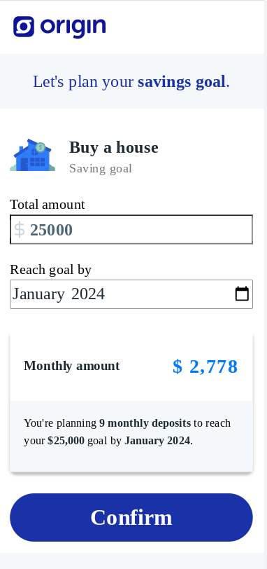
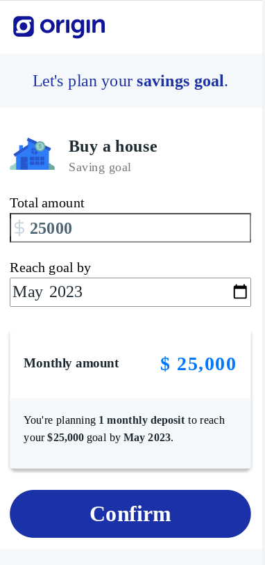
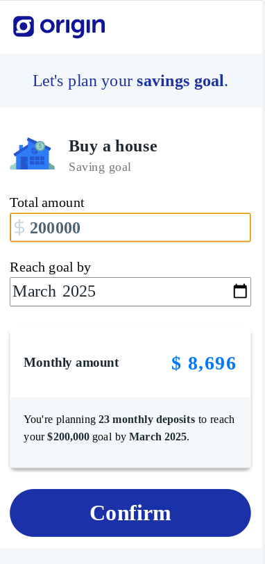
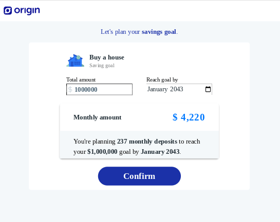
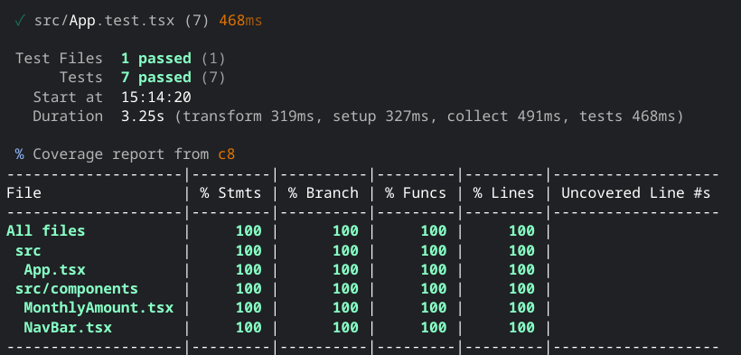
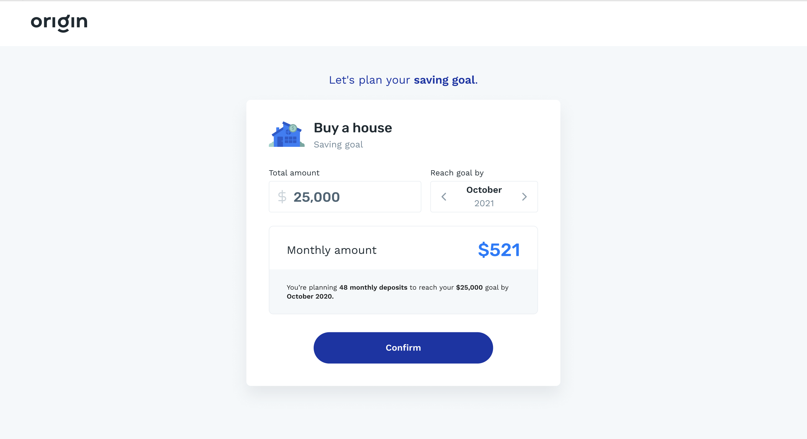

# Origin Frontend Take-Home Assignment

This is my solution to this [repo](https://github.com/OriginFinancial/frontend-take-home-assignment).

## Screenshots 



***



***



***



*** 



***

## Overview

**IMPORTANT**: you can choose any technology stack to implement this assignment. Using our stack is not a requirement in the selection process - we will consider exclusively the quality of your project (technology and product-wise) to evaluate your work. We've added a project structure in this repository (a buildwith react, redux, jest, styled-components and typescript) to save you time if you want to use it. If you prefer another stack, feel free to use it.

Origin is a platform that helps our customers' employees put their financial lives on track.

One key to financial well-being is planning & saving for your goals. Users can have many saving goals (e.g. go to college or throw a wedding party) and it is our job to help them accomplish it.

You will build a piece of our savings feature by creating the savings plan simulation screen.

### The Saving Goal Plan Simulation Screen



You will build a screen where the user will simulate saving towards the "Buy a house" savings goal.
In it, the users choose (i) the value they want to save and (ii) the date they plan to reach the goal.

When the users change the value of any of the inputs, the monthly deposit value is calculated and displayed to them.

# Development Instructions

### Evaluation
Be aware that Origin will mainly take into consideration the following evaluation criteria:
* How close your page is to the mockups, both on mobile & desktop;
* How clean and organized your code is;
* How good your automated tests are, i.e.: qualitative over quantitative (in case of usage of this base project, feel free to choose between jest or testing library);
* If you implemented the business rules correctly.

### Assets
You can find the layout mockups here on our Figma project:
[Layout mockups](https://www.figma.com/file/Axdg0WSJURcxp8Arq3gg9x/Take-Home-Assignment-v2)

Once you have opened the link you must sign up and log in so you can have access to the colors, fonts, margins and assets information.

#### Money input

The money input component should:

- Allow only numbers
- Display the value formatted as money (e.g 3500.45 should be 3,500.45)
- We recommend you name this input as "amount"

#### Date input

The date input component should:

- Allow only future months
- When clicking on the arrow buttons it should go up and down month by month
- On focused, the users should be able to move the months by typing the Left and Right arrow key on the keyboard
- We recommend you name this input as "reachDate"

#### Confirm button

You don't need to add any action on the confirmation button

## How to Use

To clone and run this application, you'll need [Git](https://git-scm.com) and [Node.js](https://nodejs.org/en/download/) (which comes with [npm](http://npmjs.com)) installed on your computer. From your command line:

```bash
# Clone this repository 
$ git clone https://jdegand.github.io/origin-frontend-take-home-assignment

# Install dependencies
$ npm install

# Start
$ npm run dev

# Test
$ npm run coverage

# Prettier
$ npm run prettier
```

## Thoughts

- Originally, App had one change handler and a formData state object.  
- I think the number input should be debounced to prevent wasted calculation in the MonthlyAmount component.  
- Looked up many debounce examples and I never saw any example of debouncing where state was an object.    
- I had problems with using a useDebounce hook. I used react profiler to make sure the component was being debounced. The MonthlyAmount calculation was debounced but component was still being re-rendered on every input.  Tried wrapping the useDebounce call in a useCallback / useMemo functions and neither worked.  The useMemo call violated the rules of hooks and the useCallback hook seemed to do nothing.  This leads me to believe the hook was faulty. So I found react-debounce-input package and used its DebounceInput component. 
- Number-only input can be a minefield of problems especially cross-platform. 'e' breaks number inputs.  
- Tried to use pattern "[0-9]+" on DebounceInput with type="text" - but it did not seem to work. Pattern is passed onto the input, but it doesn't prevent letters from being pressed.  I think some validation is skipped in the react-debounce-input implementation. Read more [here](https://github.com/nkbt/react-debounce-input/issues/130) about some of the quirks of the package.  Ultimately, it probably would be best to either clone and rework the component or find try to find another package that does the same thing.
- Re-styling the month input is a huge undertaking for little practical reason.  
- Originally, saved the day's date to state in MonthlyAmount component - moved state up since I needed access to the day's date for the calculation of the min value.  
- Used a nested ternary for min value implementation.
- Testing the min of reachDate was problematic - needed to set a mock date time.
- Decimal places are not restricted on the number input - the result is rounded up, so this only has to be accounted for in the MonthlyAmount recap paragraph.
- Index.css contains the css reset. 
- App.css contains all the rest of the css - with comments dividing the different components.  
- If you were to extract each component's css to a separate file, you would need to disentangle the media query stylings.

## Useful Resources

- [Dev.to](https://dev.to/fenok/stretching-body-to-full-viewport-height-the-missing-way-2ghd#:~:text=Applying%20min%2Dheight%3A%20100vh%20to,grow%20even%20more%20if%20necessary) - viewport height
- [YouTube](https://www.youtube.com/watch?v=qCxd36b1xqs) - Using a Single Change Handler in React with Typescript
- [Stack Overflow](https://stackoverflow.com/questions/44321326/property-value-does-not-exist-on-type-eventtarget-in-typescript) - property values does not exist on type eventtarget
- [Blog](https://www.sharooq.com/how-to-find-the-type-of-an-event-in-reactjs-using-typescript) - event type typescript
- [Stack Overflow](https://stackoverflow.com/questions/49381592/currentcolor-in-background-image-svg) - currentColor in background image svg
- [Coding Beauty](https://codingbeautydev.com/blog/javascript-get-number-of-months-between-two-dates/) - get number of months between 2 dates
- [Stack Overflow](https://stackoverflow.com/questions/40350288/typescript-thinks-getyear-does-not-exist-on-type-date) - date.getYear() deprecated
- [YouTube](https://www.youtube.com/watch?v=uojLJFt9SzY) - REACT MEMO vs USECALLBACK vs USEMEMO
- [Blog](https://dmitripavlutin.com/react-throttle-debounce/) - react throttle debounce
- [YouTube](https://www.youtube.com/watch?v=PySFIsgXNZ0) - Create a Search Bar With React and Debounce Input
- [Blog](https://www.aleksandrhovhannisyan.com/blog/managing-complex-state-react-usereducer/) - managing complex state useReducer
- [Usehooks TS](https://usehooks-ts.com/react-hook/use-debounce) - useDebounce
- [YouTube](https://www.youtube.com/watch?v=DTeY9psVDDg) - Search in React using debouncing | useCallback
- [Decipher.dev](https://decipher.dev/30-seconds-of-typescript/docs/debounce/) - debounce
- [Stack Overflow](https://stackoverflow.com/questions/59383595/how-to-debounce-a-controlled-input) - debounced a controlled input
- [Developer Way](https://www.developerway.com/posts/debouncing-in-react) - debouncing in react
- [Dev.to](https://dev.to/bugs_bunny/debouncing-react-controlled-components-588i#controlled) - debouncing react controlled components
- [YouTube](https://www.youtube.com/watch?v=Wf7INnelvkI) - Debounced Input using a custom hook in reactjs
- [Blog](https://medium.com/@philip.andrewweedewang/debounce-hook-in-react-typescript-in-20-lines-of-code-9cde26254d10) - debounce hook in react typescript
- [Github](https://gist.github.com/ca0v/73a31f57b397606c9813472f7493a940) - debounce gist
- [Blog](https://blog.logrocket.com/create-custom-debounce-hook-react/) - custom debounce hook 
- [No Deploy Friday](https://nodeployfriday.com/posts/react-debounce/) - react debounce
- [Blog](https://leewarrick.com/blog/how-to-debounce/) - how to debounce
- [Stack Overflow](https://stackoverflow.com/questions/48653412/tolocalestring-not-showing-commas-on-numbers-with-decimals) - toLocaleString 
- [Stack Overflow](https://stackoverflow.com/questions/55616536/lodash-debounce-in-react-functional-component-not-working) - lodash debounce not working
- [YouTube](https://www.youtube.com/shorts/nnZS761ngXE) - Number-only inputs aren't so straight-forward
- [Stack Overflow](https://stackoverflow.com/questions/39291997/how-to-block-e-in-input-type-number) - block e in input type number
- [YouTube](https://www.youtube.com/watch?v=QnBmrBzbpkg) - Why the HTML number input is the worst
- [YouTube](https://www.youtube.com/watch?v=cchqeWY0Nak) - Setting up vite, React, TypeScript, eslint, prettier, vitest, testing-library and react-router
- [Github](https://github.com/CodingGarden/react-ts-starter) - react ts starter
- [Blog](https://markus.oberlehner.net/blog/using-testing-library-jest-dom-with-vitest/) - testing library jest dom with vitest
- [Blog](https://medium.com/javascript-scene/nested-ternaries-are-great-361bddd0f340) - nested ternaries
- [Dev.to](https://dev.to/joannaotmianowska/how-to-test-current-time-with-jest-and-react-testing-library-a12#:~:text=This%20is%20how%20the%20test,12%3A00%20GMT') - current time with jest
- [YouTube](https://www.youtube.com/watch?v=G--iuQ6sVS8) - How to test new Date? | Test ReactJs Component
- [Stack Overflow](https://stackoverflow.com/questions/29719631/how-do-i-set-a-mock-date-in-jest) - how do i set a mock date in jest
